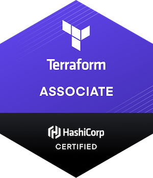

# Terraform Study Guide
Study Guide for the Terraform Associate Certification 2020

## Objectives 

  - [x] 1. [Understand Infrastructure as Code (IaC) concepts](/Objective%201%20&%202/Iac.md)

  - [x] 2. [Understand Terraform's purpose (vs other IaC)](/Objective%201%20&%202/Iac.md)

  - [x] 3. [Understand Terraform basics](/Objective%203/terraform-basics.md)
  - [x] 4.[Use the Terraform CLI (outside of core workflow)](/Objective%204/terraform-cli.md)
  - [x] 5. [Interact with Terraform modules](/Objective%205/modules.md)
  - [x] 6. [Navigate Terraform workflow](/Objective%206/workflow.md)
  - [x] 7. [Implement and maintain state](/Objective%207/manage-state.md)
  - [x] 8. [Read, generate, and modify configuration](/Objective%208/hcl-features.md)
  - [x] 9. [Undersstand Terraform Cloud and Enterprise capabilities](/Objective%209/cloud-and-enterprise.md)

## TODO 
 - [ ] Review and format 
 - [ ] Add HCL examples
-------------------------------

## Additional Hashicorp Resources
- The exam will be on Terraform 0.12.0 and higher. 
- [Exam Review](https://learn.hashicorp.com/terraform/certification/terraform-associate-review)
- [Sample Questions](/Sample%20Questions%20/Question-Answer.md)
- [Official Study Guide](https://learn.hashicorp.com/tutorials/terraform/associate-study)
- [Lab Tutorials](https://learn.hashicorp.com/tutorials/terraform/infrastructure-as-code?in=terraform/aws-get-started)
- [Terraform Registry - find modules for deploying common infra](https://registry.terraform.io/)
- [Terraform feature pdf](/tf-feature-table.pdf) or [View on the webiste](https://www.hashicorp.com/products/terraform/pricing/)
  
## Additional External Resources
- 🌟 Anki Flashcards [Download](/anki/) or [Web link](https://ankiweb.net/shared/info/180398604) 🌟
- [General Terraform Best Practices](https://www.terraform-best-practices.com/)
- [Terraform Cloud Interactive Learning](https://www.katacoda.com/courses/terraform)
- [A Cloud Guru Terraform Cheatsheet](https://res.cloudinary.com/acloud-guru/image/fetch/c_thumb,f_auto,q_auto/https://acg-wordpress-content-production.s3.us-west-2.amazonaws.com/app/uploads/2020/11/terraform-cheatsheet-from-ACG.pdf)
- Practice Exams 
  - <s>[Udemy](https://www.udemy.com/course/hashicorp-certified-terraform-associate-2020-practice-exam/)</s>
  - [Medium](https://medium.com/bb-tutorials-and-thoughts/250-practice-questions-for-terraform-associate-certification-7a3ccebe6a1a)
  - [Youtube overview of the exam and practice questions](https://www.youtube.com/watch?v=vhZEdqlXlSs&list=PL5VXZTK6spA2HF5Kf0rI9RDRHF9Hopffr)

  NOTE: Most of this information comes directly from the [Hashicorp website](https://learn.hashicorp.com/terraform/certification/terraform-associate-study-guide) I've compiled the resources here for accessibility and easy review. 🙂 If you find this study guide useful please give it a 🌟 and check back for updates! 
